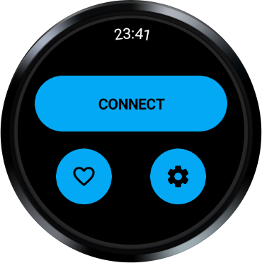
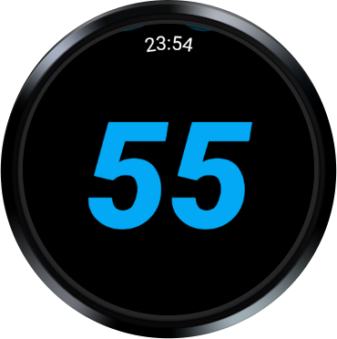
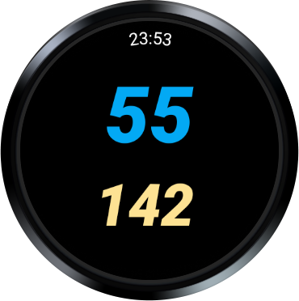

# Wearwind

_Control your [Wahoo Headwind fan][headwind] from a [Wear OS][wearos] watch._

## Background

The [Headwind fan][headwind] features a Bluetooth GATT service, which, among
other things, allows remote:

- Turning on and off of the fan
- Setting the fan speed

This project uses the Bluetooth functionality of your Wear OS watch to connect
to the Headwind service, and control it.

Optionally, instead of manually setting the speed through up/down swipes, the
wrist HR sensor can be used such that fan speed increases as HR does. 

## Setup and use

1.  Clone this project 
1.  Open in Android Studio
1.  Build
1.  Deploy to your Wear OS device.
1.  _Hop on your bike trainer, launch the app on your watch, and power on the fan!_

## License

This project makes extensive use of [Punchthrough Android BLE starter][starter],
which is released under the [Apache 2.0 license][punchthrough-license].

This code can be seen in the `com.punchthrough.ble` package in the repository.

[wearos]: https://wearos.google.com/
[headwind]: https://www.wahoofitness.com/devices/bike-trainers/kickr-accessories/kickr-headwind
[starter]: https://github.com/PunchThrough/ble-starter-android
[punchthrough-license]: https://github.com/PunchThrough/ble-starter-android/blob/master/LICENSE
